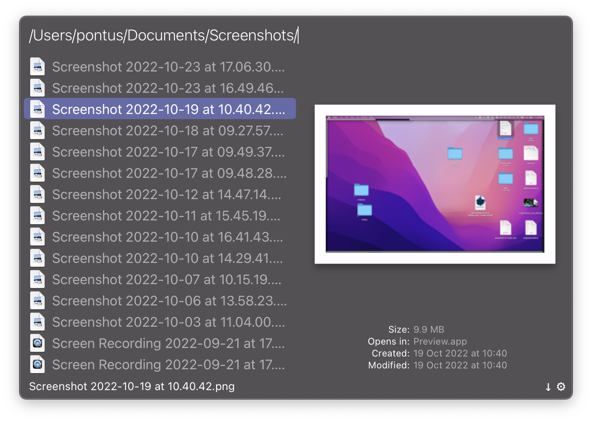

# List Screenshots

[⤓ Download Workflow](https://github.com/psu/alfred-list-screenshots/releases/latest/download/List%20Screenshots.alfredworkflow)

## About

List macOS Screenshots in Alfred, triggered by a Hotkey or a Keyword.
The workflow is super simple, but propably my most used one. Hope you will find it usefull too!

## Features

- Trigger with Hotkey or Keyword.
- Filter out everything but PNG images and QuickTime movies.
- Open selected file with Enter (Quick view with Shift as usual in Alfred).
- Always sorts files by creation date.

## Installation

1. Download and add to Alfred.
2. Navigate to the folder where macOS automatically saves your Screenshots (defaults to ~/Desktop).
3. In the workflow open "File Filter" (yellow), select "Scope", and drag the folder to the list.
